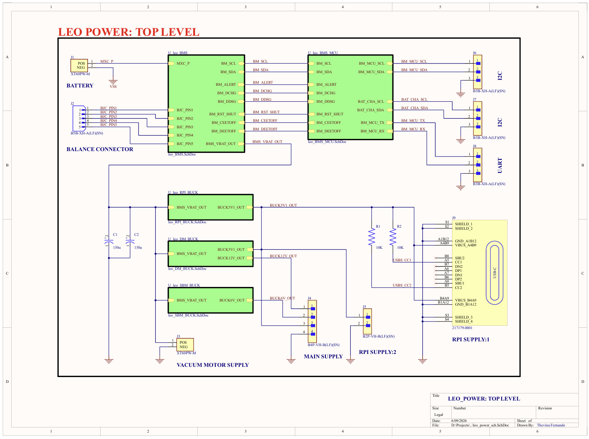
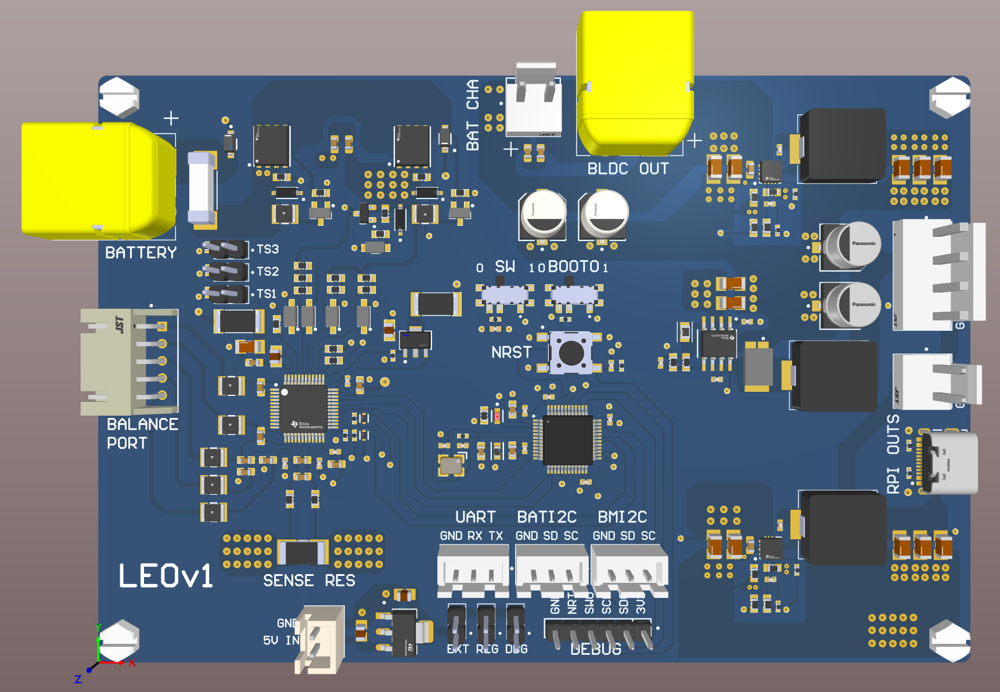
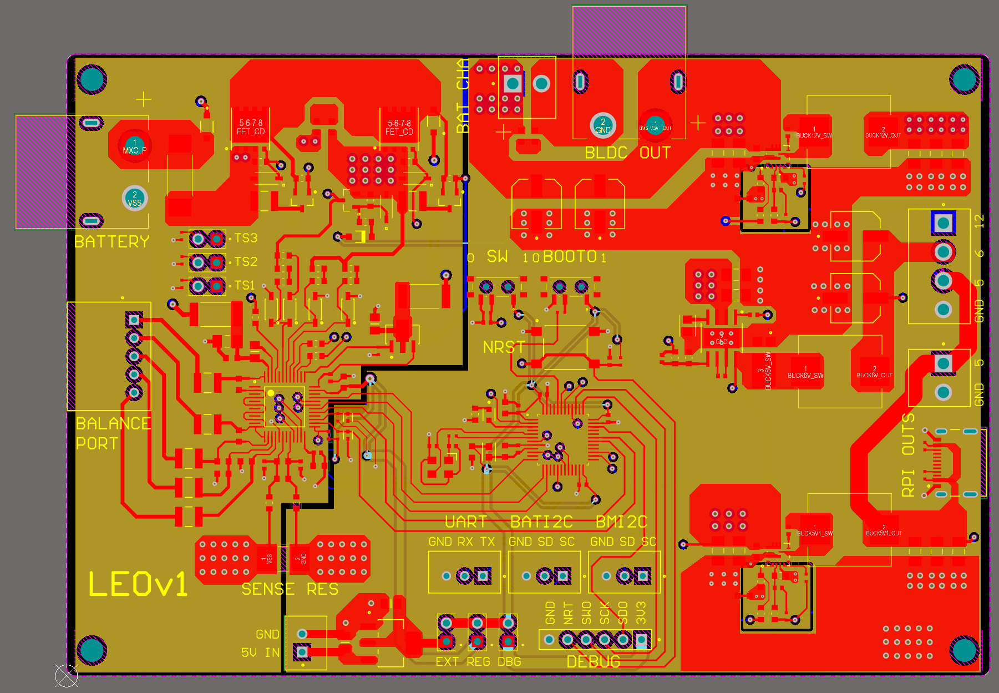
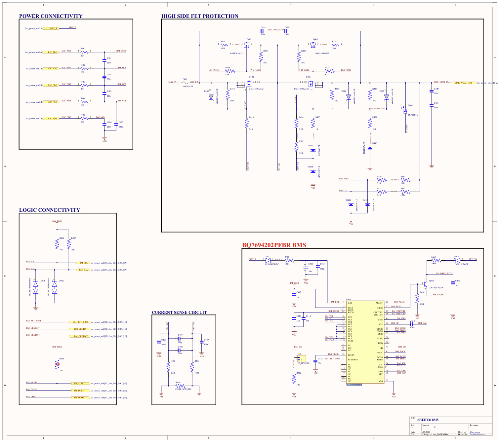
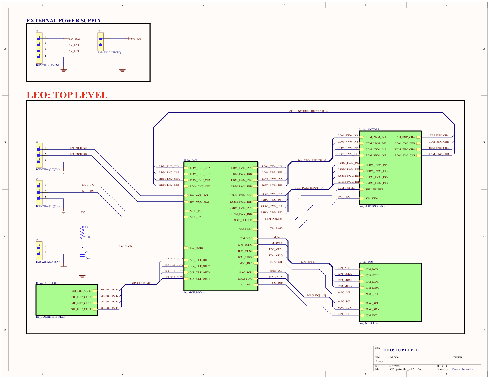
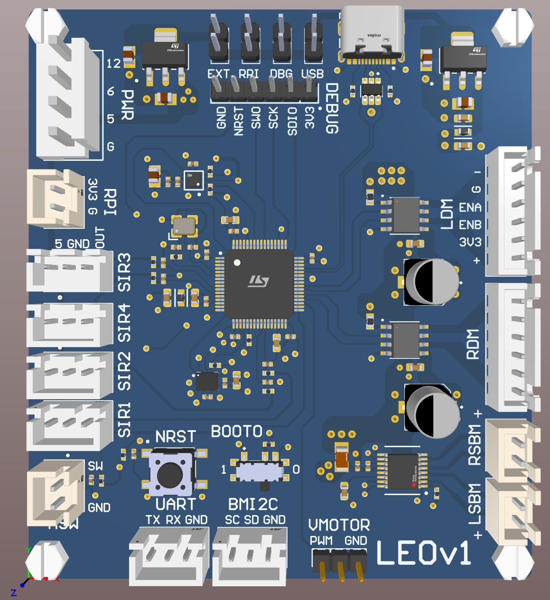
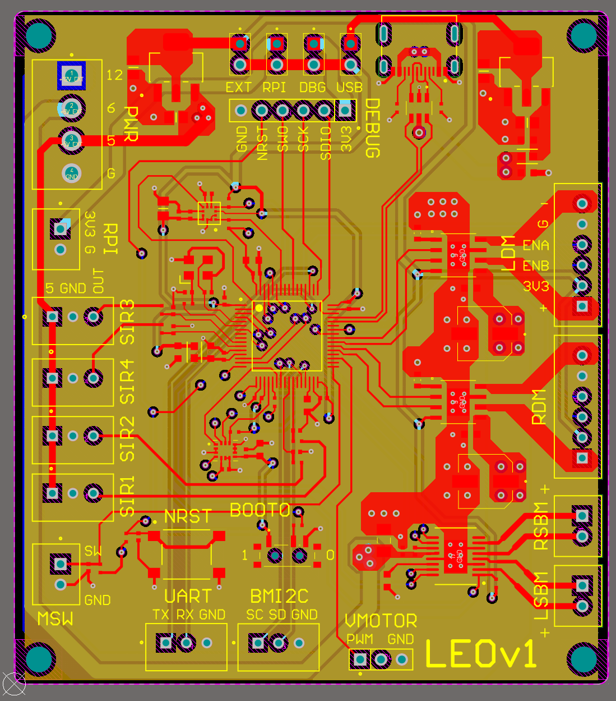

# Leo PCB Designs

This folder contains the custom PCB designs for **Leo**, an autonomous floor cleaning robot. The electronics are split across two boards that together handle power delivery/battery management and sensing/actuation/compute control:

| Board | Folder | Primary MCU | Role |
|---|---|---|---|
| **Leo Power PCB** | [`leo_POWER/`](leo_POWER) | STM32L431CCT6 | Battery management, cell protection, and regulated power distribution |
| **Leo Main Controller PCB** | [`leo_PCB/`](leo_PCB) | STM32F722RET6 | Sensor fusion, motion control, motor driving, and Raspberry Pi interfacing |

Both boards were designed in Altium Designer. Each board folder follows the same layout:

```
leo_POWER/ (or leo_PCB/)
├── pcb_files/       # Altium .PcbDoc layout
├── pcb_3d/           # STEP export of the 3D board model
└── schematics/        # .SchDoc source sheets + sch_pdfs/ (exported PDF schematics)
```

Supporting material lives alongside the two board folders:

- [`assets/`](assets) — renders and screenshots of both boards (3D views, PCB layouts, top-level schematics)
- [`docs/`](docs) — WEBENCH design reports for the TPS56637RPAR buck converter regulation points (12 V drive motor rail and 5.1 V Raspberry Pi rail), covering startup, load transient, input transient, and steady-state behavior
- [`tests/`](tests) — bring-up/validation test recordings for both boards

The two boards connect to each other and to the rest of the robot (Raspberry Pi, drive/side-brush/vacuum motors, cliff sensors) via JST XH/VH pluggable headers, keeping the power stage and the compute/sensor stage electrically and physically separable.

---

## Power PCB (`leo_POWER`)

Full schematic: [`leo_POWER/schematics/sch_pdfs/leo_power_schs.pdf`](leo_POWER/schematics/sch_pdfs/leo_power_schs.pdf)





The power board takes the raw Li-ion/Li-Po pack input through an XT60 connector, protects and monitors the pack, and fans the battery rail out into the regulated rails the rest of the robot needs.

### Smart Battery Management System (BMS)

The heart of the power board is a **smart BMS built around the TI [BQ7694202PFBR](https://www.ti.com/product/BQ76942)** analog front end (sheet 4 — *BMS*, [`leo_BMS.SchDoc`](leo_POWER/schematics/leo_BMS.SchDoc)):



- **High-side FET protection stack** — rather than switching the pack ground return, charge (Q402/Q404) and discharge (Q403/Q405) protection FETs (CSD18531Q5AT) are placed high-side on the pack-positive path, gate-driven through the BQ76942's `CHG`/`DSG`/`CFETOFF`/`DFETOFF` outputs with dedicated level-shifting and gate-protection networks (Zener clamps, gate pull-downs, and a `PCHG`/`PDSG` pre-charge/pre-discharge path to soften inrush into downstream capacitance).
- **Cell sensing** — up to a 10-series cell stack is monitored through the `VC0`–`VC10` taps, with per-cell RC filtering (`R401`–`R405` / `C401`–`C405`) for noise immunity.
- **Coulomb counting / current sense** — a dedicated low-side sense resistor (`R410`) feeds the `SRP`/`SRN` differential inputs for pack current measurement.
- **Thermal monitoring** — `TS1`–`TS3` thermistor inputs for pack temperature.
- **Protection I/O** — `ALERT`, `DCHG`, `DDSG`, `RST_SHUT`, `CFETOFF`, `DEETOFF` are broken out to the host MCU for fault handling and firmware-level control of the protection FETs.
- **Communication** — the BQ76942 exposes its status/config over I²C (`BM_SCL`/`BM_SDA`) to the on-board host MCU, and a separate I²C bus (`BAT_CHA_SCL`/`BAT_CHA_SDA`) plus UART (`BM_MCU_TX`/`BM_MCU_RX`) are broken out on JST headers (J6–J8) for an external battery charger / host system.
- A 5-pin balance connector (`J2`) taps off the individual cell junctions for external cell balancing/monitoring hardware.

### BMS Host MCU

Sheet 5 — *BMS MCU* ([`leo_BMS_MCU.SchDoc`](leo_POWER/schematics/leo_BMS_MCU.SchDoc)) implements a small, self-contained supervisory controller around an **STM32L431CCT6** (ARM Cortex-M4, ultra-low-power series):

- Bridges the BQ76942's I²C register interface and protection/fault lines to the outside world, and can drive `RST_SHUT`/`CEETOFF`/`DEETOFF` to intervene on the protection FETs directly.
- Locally regulated 3.3 V rail (`LDL1117S33R` LDO) fed from an external 5 V input, independent of the switching buck rails, so BMS supervision stays alive even while the downstream buck converters are disabled/faulted.
- Standard STM32 bring-up peripherals: 24 MHz crystal, SWD debug header (`J505`), BOOT0 and NRST push-buttons, and a status LED.
- Power-source selector jumpers (debug supply vs. external 5 V vs. `BM_REG1` from the BQ76942's internal regulator) for flexible bench bring-up.

### Buck Converter Power Distribution

Once the BQ76942 high-side FETs are enabled, `BMS_VBAT_OUT` (the protected pack rail) feeds three independent synchronous buck regulators, each on its own schematic sheet:

| Sheet | Converter | IC | Output | Feeds |
|---|---|---|---|---|
| Sheet 1 — [`leo_SBM_BUCK.SchDoc`](leo_POWER/schematics/leo_SBM_BUCK.SchDoc) | VBAT → 6 V | TI `LMR14030SDDAR` | `BUCK6V_OUT` | Side-brush motor drivers |
| Sheet 2 — [`leo_DM_BUCK.SchDoc`](leo_POWER/schematics/leo_DM_BUCK.SchDoc) | VBAT → 12 V | TI `TPS56637RPAR` | `BUCK12V_OUT` | Drive motor (wheel) motor drivers |
| Sheet 3 — [`leo_RPI_BUCK.SchDoc`](leo_POWER/schematics/leo_RPI_BUCK.SchDoc) | VBAT → 5.1 V | TI `TPS56637RPAR` | `BUCK5V1_OUT` | Raspberry Pi (via USB-C, `J9`) and the main controller PCB / logic supplies |

- The 12 V and 5.1 V rails both use the `TPS56637RPAR`, sized with a power-good output and feedback compensation tuned per rail; see the WEBENCH design reports in [`docs/TPS56637RPAR_12V_webench_reports/`](docs/TPS56637RPAR_12V_webench_reports) and [`docs/TPS56637RPAR_5.1V_webench_reports/`](docs/TPS56637RPAR_5.1V_webench_reports) for startup, load-transient, input-transient, and steady-state simulation results used to validate the compensation and output filter design.
- The 5.1 V rail is delivered to the Raspberry Pi over a dedicated USB-C connector (`J9`) wired for power-only delivery (CC lines pulled via `R1`/`R2` to present as a fixed-current source), in addition to being distributed to the rest of the system as `BUCK5V1_OUT`.
- All three converters share the same protected battery input, so a BMS-level fault (over-current, over/under-voltage, over-temperature) that opens the high-side FETs removes power from the entire downstream system.

---

## Main Controller PCB (`leo_PCB`)

Full schematic: [`leo_PCB/schematics/sch_pdfs/leo_schs.pdf`](leo_PCB/schematics/sch_pdfs/leo_schs.pdf)





The main controller board is the robot's central nervous system: it runs sensor fusion and motion control, drives all motors, and bridges to the Raspberry Pi for high-level autonomy.

### STM32F722RET6 Host MCU

Sheet 1 — *MCU* ([`leo_MCU.SchDoc`](leo_PCB/schematics/leo_MCU.SchDoc)) is built around an **STM32F722RET6** (ARM Cortex-M7 @ up to 216 MHz), chosen for the headroom to run real-time motor control loops alongside sensor polling/fusion. Supporting circuitry includes:

- 24 MHz main crystal, SWD debug header, BOOT0/NRST buttons, and status/power LEDs — standard STM32 bring-up.
- Independent 5 V→3.3 V LDO regulation (`LDL1117S33R`) for both the USB and general logic domains, with selector headers to source 3.3 V from USB, external supply, debug supply, or the Raspberry Pi rail.
- Fans out SPI (IMU), I²C (magnetometer, BMS link), UART (BMS MCU link), and PWM/GPIO (motor drivers, cliff sensors) to the rest of the board's subsystems.

### PCB-Integrated IMU

Sheet 3 — *IMU Unit* ([`leo_IMU.SchDoc`](leo_PCB/schematics/leo_IMU.SchDoc)) integrates inertial sensing directly on the main board rather than as an external module:

- **TDK `ICM-42688-P`** 6-axis IMU (accelerometer + gyroscope) on SPI (`ICM_NCS`/`ICM_SCLK`/`ICM_MOSI`/`ICM_MISO`), with an interrupt line (`ICM_INT`) back to the MCU for data-ready signaling.
- **ST `IIS2MDCTR`** 3-axis magnetometer on I²C (`MAG_SCL`/`MAG_SDA`), with its own interrupt (`MAG_INT`).
- Together these feed the sensor fusion / odometry stack (complementing the wheel encoders) used for SLAM and heading estimation, without relying on an external breakout board.

### On-Board Motor Controllers

Sheet 2 — *Motor Controllers* ([`leo_MOTORS.SchDoc`](leo_PCB/schematics/leo_MOTORS.SchDoc)) integrates all motor driving directly on the main PCB:

- **Two TI `DRV8251ADDAR`** H-bridge drivers (12 V rail) for the left/right **drive motors**, each with current-sense output (`IPROPI`) fed back to the MCU through a sense resistor, and quadrature encoder feedback (`ENC_CHA`/`ENC_CHB`) routed back for closed-loop wheel odometry/speed control.
- **One TI `DRV8833PWPR`** dual H-bridge driver (6 V rail) driving the **left/right side-brush motors**, with a shared sleep/enable line (`SBM_NSLEEP`).
- A dedicated PWM-controlled connector (`J205`) for the **vacuum motor**, switched off the external supply rail.
- This keeps all motor drive electronics — and their associated switching noise — localized on one board with direct, short traces to the MCU's PWM timers and encoder inputs, rather than requiring external driver modules.

### Raspberry Pi USB-C Bridge

The board exposes a **USB 2.0 Type-C connector** (`J101`, sheet 1) wired as a USB high-speed data bridge (not just power) between the STM32F722 and the Raspberry Pi, with `USBLC6-2SC6` ESD protection on the D+/D− lines. This is the primary high-bandwidth link the Raspberry Pi uses to command the MCU and receive sensor/telemetry data for the robot's autonomy stack, alongside the lower-speed UART/I²C links to the power PCB.

### Additional Subsystems

- **Cliff sensors** — Sheet 4 ([`leo_FLOORSEN.SchDoc`](leo_PCB/schematics/leo_FLOORSEN.SchDoc)) conditions four Sharp `GP2Y0A51SK0F` IR distance sensors through RC low-pass filters before feeding the MCU's ADC inputs, used for drop/cliff detection.
- **External power input** — the board accepts the 12 V, 6 V, and 5 V rails generated by the power PCB, plus the Raspberry Pi's 3.3 V rail, over JST headers.

---

## Testing

Bring-up and functional validation recordings for both boards are in [`tests/`](tests):

- [`power_pcb_test.MP4`](tests/power_pcb_test.MP4) — power PCB validation: BMS protection FET behavior, buck converter rail startup, and output regulation.
- [`main_pcb_test.MP4`](tests/main_pcb_test.MP4) — main controller PCB validation: MCU bring-up, motor driver outputs, and IMU/sensor readout.

Buck converter regulation performance (startup, load transient, input transient, steady-state) was additionally validated against WEBENCH simulation reports prior to fabrication — see [`docs/`](docs).
